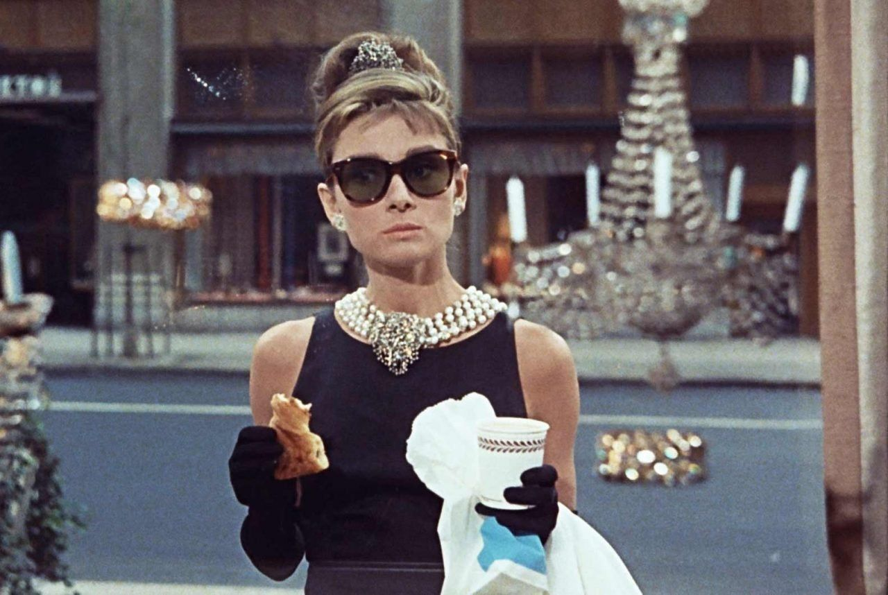

# Machine learning para predecir el precio de los diamantes  
## [Competición](https://www.kaggle.com/c/diamonds-datamad0820) de Ironhack en Kaggle

Este proyecto forma parta de una competición donde debemos de precedir el precio de los diamantes poniendo en práctica las técnicas de machine learning que hemos visto.
Para ello, contamos con 2 datasets: uno para entrenar y otro para realizar las pruebas.

### Características de los diamantes

- id: solo para archivos de envío de prueba y muestra, id para identificación de muestra de predicción
- precio: precio en USD
- quilates: peso del diamante
- corte: calidad del corte (Regular, Bueno, Muy Bueno, Premium, Ideal)
- color: color diamante, de J (peor) a D (mejor)
- claridad: una medida de la claridad del diamante (I1 (peor), SI2, SI1, VS2, VS1, VVS2, VVS1, IF (mejor))
- x: longitud en mm
- y: ancho en mm
- z: profundidad en mm
- profundidad: porcentaje de profundidad total = z / media (x, y) = 2 * z / (x + y) (43--79)
- tabla: ancho de la parte superior del diamante en relación con el punto más ancho (43--95)

### Modelos implementados 

- GradientBoostingRegressor 
- RandomForestRegressor 
- ANN (red neuronal artificial) 

### Técnicas sugeridas

- One hot encoding
- Label encoding
- Get dummies 
- PCA
- API / web scraping
- Regression

### Librerías

Matplotlib
Pandas
Nummpy 
Skalearn
Keras
Math
